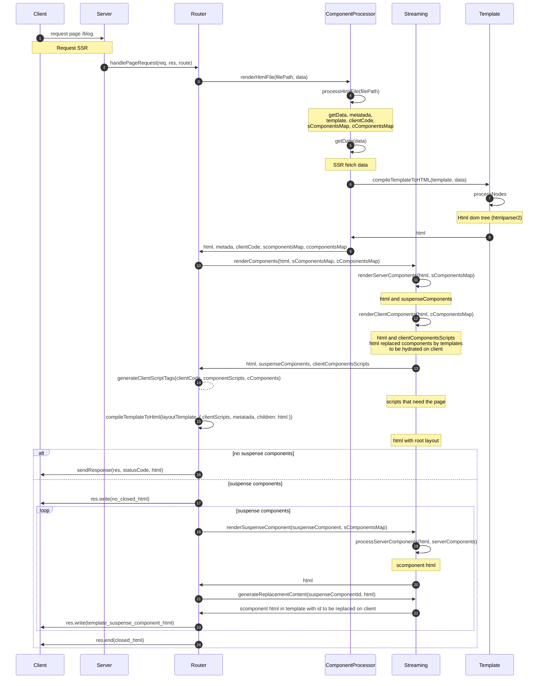

# Vanilla JS Framework

A minimalist vanilla JavaScript framework with support for Server-Side Rendering (SSR), Client-Side Rendering (CSR), reactive components, and streaming with suspense.

## 📁 Project Structure

```
├── pages/                    # Application pages
│   ├── layout.html          # Main layout (header, footer, etc.)
│   ├── page.html            # Home page
│   ├── error/page.html      # Error page
│   ├── not-found/page.html  # 404 page
│   ├── meteo-csr/page.html  # CSR example
│   └── meteo-ssr/page.html  # SSR example
├── public/                   # Static assets
│   ├── app/services/        # Client framework core
│   │   ├── component.js     # Component base class
│   │   ├── reactive.js      # Reactivity system
│   │   ├── html.js          # Tagged template literal
│   │   ├── decorators.js    # Component decorators
│   │   ├── hydrate.js       # Component hydration
│   │   └── navigation.js    # Client router
│   ├── components/          # Client components (c-*)
│   └── styles.css           # Styles (Tailwind)
└── server/                   # Node.js server
    ├── index.js             # Entry point
    ├── router.js            # Router and SSR rendering
    ├── _app/routes.js       # Route definitions
    ├── components/          # Server components (s-*)
    └── utils/
        ├── template.js      # Template rendering
        └── streaming.js     # Suspense and streaming
```

## 🚀 Quick Start

```bash
# Install dependencies
pnpm install

# Start development server
pnpm dev

# Build for production
pnpm build
```

The server will be available at `http://localhost:3000`

## 📄 Creating a Page

Pages are created in `pages/` with the following structure:

```html
<!-- pages/example/page.html -->
<script server>
  // Code that runs on the server
  async function getData() {
    return { message: "Hello from the server" };
  }

  const metadata = {
    title: "My Page",
    description: "Page description",
  };
</script>

<script client>
  // Client component imports
  import "/public/components/Counter.js";
</script>

<template>
  <h1>{{message}}</h1>
  <c-counter start="0"></c-counter>
</template>
```

**Register the route** in `server/_app/routes.js`:

```js
export const routes = [
  { path: "/example", meta: { ssr: true, requiresAuth: false } },
];
```

## 🧩 Components

### Client Component (CSR)

Client components are interactive and reactive. They are defined with the `c-` prefix with `defineComponent`:

```js
// public/components/counter.js
import { Component } from "../app/services/component.js";
import { defineComponent } from "../app/services/decorators.js";
import { html } from "../app/services/html.js";
import { reactive } from "../app/services/reactive.js";

export class Counter extends Component {
  count = reactive(0);

  increment() {
    this.count.value++;
  }

  render() {
    return html`
      <button @click="${this.increment}" class="btn">
        Count: ${this.count.value}
      </button>
    `;
  }
}

defineComponent("counter")(Counter);
```

**Usage in HTML:**

```html
<c-counter start="5"></c-counter>
```

### Server Component (SSR)

Server components are rendered on the backend. They are defined with the `s-` prefix:

```js
// server/components/user-card.js
export default async function UserCard({ userId }) {
  const user = await fetch(`https://api.example.com/users/${userId}`).then(
    (res) => res.json()
  );

  return `
    <div class="user-card">
      <h3>${user.name}</h3>
      <p>${user.email}</p>
    </div>
  `;
}
```

**Usage in pages:**

```html
<s-user-card userId="123"></s-user-card>
```

## ⏳ Suspense (Streaming)

Allows showing a fallback while content loads asynchronously:

```html
<suspense fallback="<s-skeleton></s-skeleton>">
  <s-user-card-delayed userId="123"></s-user-card-delayed>
</suspense>
```

**Benefits:**

- The rest of the page is shown immediately
- Slow components load via streaming
- Improves perceived performance

## 🔄 Reactive System

The reactive system allows creating variables that automatically update the UI:

```js
import { reactive, effect } from "../app/services/reactive.js";

// Create reactive state
const state = reactive({ count: 0, name: "Alice" });

// Execute code when state changes
effect(() => {
  console.log(`Count: ${state.count}`);
});

state.count++; // Triggers the effect automatically
```

**In components:**

```js
class MyComponent extends Component {
  count = reactive(0);

  render() {
    return html`<p>Count: ${this.count.value}</p>`;
  }
}
```

## 📝 HTML Templates

The `html` helper allows creating templates with JSX-like syntax:

```js
import { html } from "../app/services/html.js";

const name = "Carlos";
const items = ["Item 1", "Item 2", "Item 3"];

const template = html`
  <div>
    <h1>Hello, ${name}</h1>

    <!-- Event listeners -->
    <button @click="${() => console.log("Click!")}">Click me</button>

    <!-- Render arrays -->
    <ul>
      ${items.map((item) => html`<li>${item}</li>`)}
    </ul>
  </div>
`;
```

## 🛣️ Routing

### Server-Side Routing

Define routes in `server/_app/routes.js`:

```js
export const routes = [
  { path: "/", meta: { ssr: true } },
  { path: "/about", meta: { ssr: true } },
  { path: "/meteo-csr", meta: { ssr: false } }, // Client-only
];
```

### Client-Side Navigation

```js
import { navigate } from "/public/app/services/navigation.js";

// Navigate without page reload
navigate("/about");
```

## 🎨 Styling

The project uses **Tailwind CSS**. Styles are compiled automatically:

```html
<div class="flex items-center justify-center p-4 bg-blue-500">
  <h1 class="text-white text-2xl">Title</h1>
</div>
```

## 🔧 Framework API

### Component

```js
class MyComponent extends Component {
  // Lifecycle hooks
  onMount() {
    console.log("Component mounted");
  }

  onDestroy() {
    console.log("Component destroyed");
  }

  // Required render method
  render() {
    return html`<div>Content</div>`;
  }
}
```

### Decorators

```js
import { defineComponent } from "../app/services/decorators.js";

// Register component with c- prefix
defineComponent("my-component")(MyComponent);
```

## 📦 Available Scripts

```bash
pnpm dev          # Development server
pnpm build        # Build for production
pnpm preview      # Preview build
pnpm format       # Format code with Biome
```

## 🏗️ Rendering Flow

### SSR (Server-Side Rendering)



### CSR (Client-Side Rendering)

1. Request → Server sends minimal HTML
2. Browser executes `<script client>`
3. Client components mount dynamically
4. Full interactivity on the client

## 🗺️ Roadmap

Future features planned for implementation:

- [x] **Language sintaxis** - Unify sintaxis to use same conditional tags, lists, etc in server and client.
- [x] **Inject client component script** - Use other technique to inject js in client, to avoid have scripts in html, check Nextjs, svelte, vue
- [x] **Metadata dynamic** - Optional add export func if the user wants to fetch. Also this func can receive the result of getData to not repeat the same fetch
- [ ] **Fix error replace marker** Only occurs when template has multiple childs no wrapped in div /fragment
- [x] **Add dynamic pages CSR and SSR** - Add dynamic routes
- [x] **Incremental Static Regeneration / Static Pages** - Regenerate static pages on-demand / never
- [x] **Generate Static Params** - Pre-generate pages with dynamic routes at build time
- [x] **Auto generated routes** - Auto generate server and client routes
- [x] **Unify** - Same constants files, unify fs functions in files, unify comments, etc
- [x] **Cache getData** - Implement caching layer for data fetching functions
- [x] **Cache Server Pages** - Cache rendered server pages for improved performance
- [x] **Link Component** - Custom link component with prefetching capabilities
- [x] **Prefetch Pages** - Automatically prefetch pages on link hover/visibility
- [ ] **Restructure Directories** - Optimize project structure and organization
- [ ] **Authentication** - Built-in authentication system with middleware support
- [ ] **Auto-generated Files** - Automatic generation of routes, utility files, and configurations based on code and pages directories
- [ ] **Custom file** - custom extension to have correct imports, lint, colors, etc. 
- [ ] **Optimize auto generated routes**
- [ ] **Layouts** - Layouts inside sub routes
- [ ] **Regeneration in background** - Regenerate page after send response (locks)
- [ ] **Cache with CDN** 
