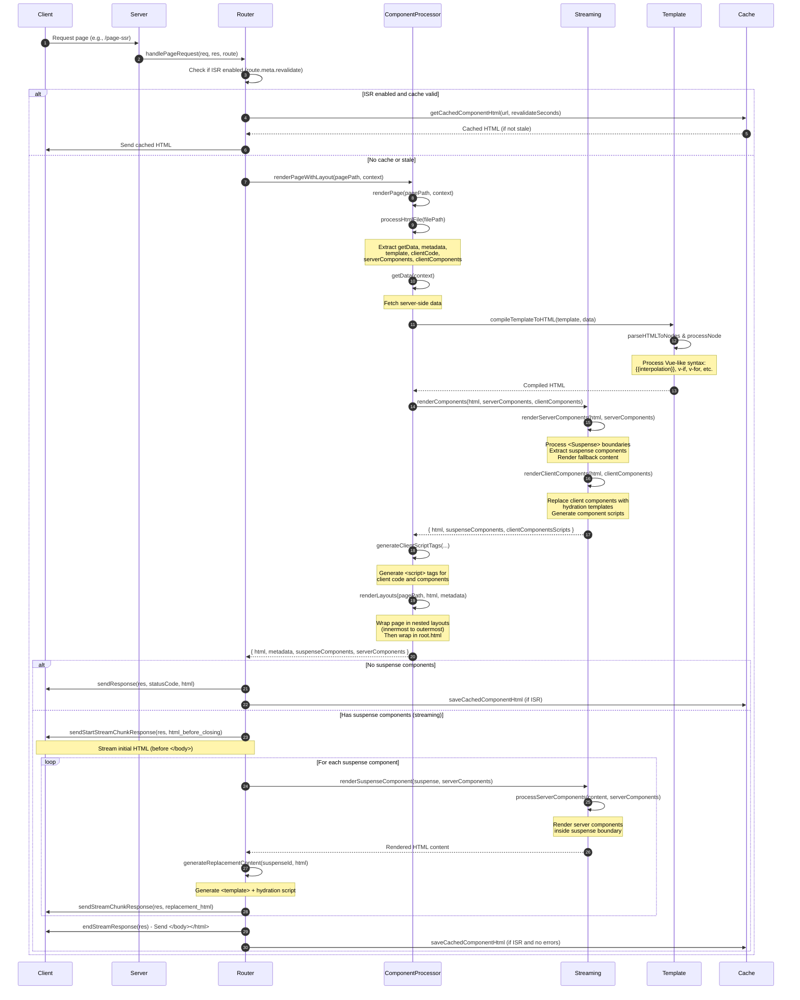
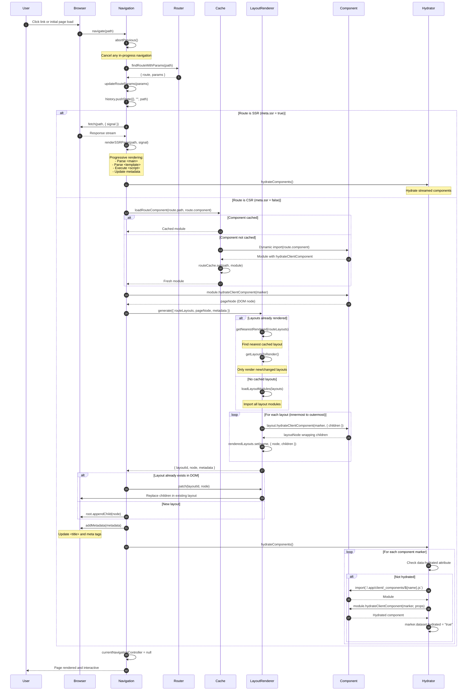
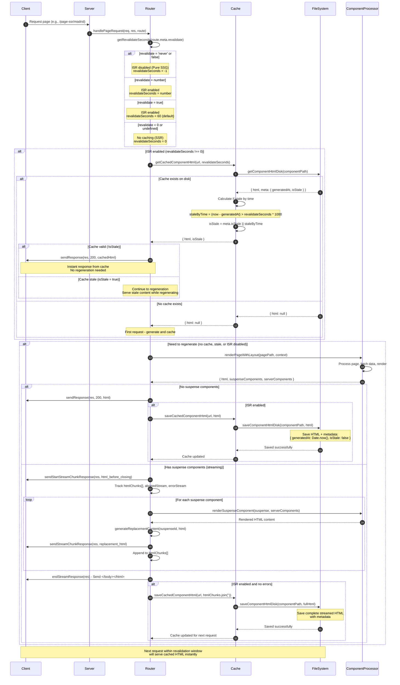

# Vanilla JS Framework

[](#)
[](#)
[](#)

A minimalist vanilla JavaScript framework with support for Server-Side Rendering (SSR), Client-Side Rendering (CSR), reactive components, and streaming with suspense.

## � Table of Contents

- [Vanilla JS Framework](#vanilla-js-framework)
  - [� Table of Contents](#-table-of-contents)
  - [✨ Key Features](#-key-features)
  - [�📁 Project Structure](#-project-structure)
  - [🚀 Quick Start](#-quick-start)
  - [📄 Creating a Page](#-creating-a-page)
  - [🧩 Components](#-components)
    - [Component Structure](#component-structure)
    - [Server Components](#server-components)
    - [Using Components](#using-components)
  - [🎭 Rendering Strategies](#-rendering-strategies)
    - [SSR - Server-Side Rendering](#ssr---server-side-rendering)
    - [CSR - Client-Side Rendering](#csr---client-side-rendering)
    - [SSG - Static Site Generation](#ssg---static-site-generation)
    - [ISR - Incremental Static Regeneration](#isr---incremental-static-regeneration)
  - [📐 Layouts](#-layouts)
    - [Root Layout](#root-layout)
    - [Custom Nested Layouts](#custom-nested-layouts)
  - [⏳ Suspense (Streaming)](#-suspense-streaming)
  - [🔄 Reactive System](#-reactive-system)
  - [📝 Template Syntax](#-template-syntax)
    - [Interpolation](#interpolation)
    - [Conditionals](#conditionals)
    - [Lists](#lists)
    - [Event Handlers](#event-handlers)
    - [Attributes](#attributes)
  - [🛣️ Routing](#️-routing)
    - [Auto-Generated Routes](#auto-generated-routes)
    - [Dynamic Routes](#dynamic-routes)
    - [Client-Side Navigation](#client-side-navigation)
    - [Accessing Route Parameters](#accessing-route-parameters)
  - [⚡ Prefetching](#-prefetching)
    - [Automatic Prefetching](#automatic-prefetching)
  - [🎨 Styling](#-styling)
  - [🔧 Framework API](#-framework-api)
    - [Component Props](#component-props)
    - [Reactive State](#reactive-state)
    - [Navigation Utilities](#navigation-utilities)
  - [📦 Available Scripts](#-available-scripts)
  - [🏗️ Rendering Flow](#️-rendering-flow)
    - [SSR (Server-Side Rendering)](#ssr-server-side-rendering)
    - [CSR (Client-Side Rendering)](#csr-client-side-rendering)
  - [🗺️ Roadmap](#️-roadmap)

## ✨ Key Features

- 🚀 **Multiple Rendering Strategies**: SSR, CSR, SSG, and ISR support
- ⚡ **Auto-Generated Routes**: File-based routing with dynamic routes `[param]`
- 🔄 **Reactive System**: Vue-like reactivity with `reactive()` and `computed()`
- 🧩 **Component-Based**: Reusable `.html` components (server & client)
- 🎭 **Streaming & Suspense**: Progressive loading with fallback UI
- 📐 **Nested Layouts**: Custom layouts per route
- 🔗 **Smart Prefetching**: Automatic page prefetching on link hover
- 💾 **Built-in Caching**: Server and client-side caching
- 🎨 **Tailwind CSS**: Integrated styling solution
- 📝 **Template Syntax**: Familiar directives (`v-if`, `v-for`, `@click`, etc.)
- 🌐 **SPA Navigation**: Client-side routing without page reloads
- 🔌 **Zero Config**: No manual route registration needed

## �📁 Project Structure

```
├── pages/                       # Application pages
│   ├── layout.html             # Main layout (header, footer, etc.)
│   ├── page.html               # Home page
│   ├── error/page.html         # Error page
│   ├── not-found/page.html     # 404 page
│   ├── page-csr/               # CSR example
│   │   ├── page.html           # CSR main page
│   │   └── [city]/page.html    # Dynamic CSR route
│   ├── page-ssr/               # SSR example
│   │   ├── page.html           # SSR main page
│   │   └── [city]/page.html    # Dynamic SSR route
│   ├── static/                 # Static page example
│   │   ├── layout.html         # Static layout
│   │   └── page.html           # Static page
│   └── static-with-data/       # Static with data example
│       └── page.html           # Static page with data fetching
├── components/                  # Component definitions (.html files)
│   ├── counter.html            # Counter component
│   ├── user-card.html          # User card component
│   ├── user-card-delayed.html  # Delayed user card (for suspense demo)
│   ├── user-card-skeleton.html # Skeleton placeholder
│   ├── weather.html            # Weather component
│   └── weather/                # Weather sub-components
│       ├── weather-links.html
│       ├── weather-params.html
│       └── weather-state.html
└── .app/                        # Framework files (do not edit)
    ├── client/                 # Client-side framework
    │   ├── services/           # Client framework core
    │   │   ├── reactive.js     # Reactivity system
    │   │   ├── html.js         # Template literal helpers
    │   │   ├── hydrate.js      # Component hydration
    │   │   ├── cache.js        # Client-side caching
    │   │   ├── navigation/     # Navigation utilities
    │   │   │   ├── router.js   # Client router
    │   │   │   ├── navigate.js # Navigation API
    │   │   │   ├── prefetch.js # Page prefetching
    │   │   │   ├── metadata.js # Dynamic metadata
    │   │   │   └── ...
    │   │   └── _routes.js      # Auto-generated routes
    │   ├── _components/        # Auto-generated component scripts
    │   ├── styles.css          # Compiled Tailwind styles
    │   └── favicon.ico         # Favicon
    └── server/                 # Server-side framework
        ├── index.js            # Entry point
        ├── root.html           # Root HTML template
        ├── _cache/             # Server-side cache
        └── utils/              # Server utilities
            ├── router.js       # Router and SSR rendering
            ├── component-processor.js  # Component processing
            ├── template.js     # Template rendering
            ├── streaming.js    # Suspense and streaming
            ├── cache.js        # Server-side caching
            ├── files.js        # File system utilities
            └── _routes.js      # Auto-generated routes
```

## 🚀 Quick Start

```bash
# Install dependencies
pnpm install

# Start development server
pnpm dev

# Start production server
pnpm start
```

The server will be available at `http://localhost:3000`

## 📄 Creating a Page

Pages are created in `pages/` with the following structure:

```html
<!-- pages/example/page.html -->
<script server>
  // Server-side imports (components)
  import UserCard from "components/user-card.html";

  // Server-side data fetching
  async function getData() {
    return { message: "Hello from the server" };
  }

  // Page metadata
  const metadata = {
    title: "My Page",
    description: "Page description",
  };
</script>

<script client>
  // Client-side component imports
  import Counter from "components/counter.html";
</script>

<template>
  <h1>{{message}}</h1>
  <Counter start="0" />
  <UserCard userId="123" />
</template>
```

**Routes are auto-generated** from the `pages/` folder structure. No need to manually register routes!

## 🧩 Components

Components are defined in `.html` files within the `components/` folder. They can be either client-side or server-side components.

### Component Structure

```html
<!-- components/counter.html -->
<script client>
  import { reactive, computed } from ".app/reactive.js";

  // Component props
  const props = vprops({
    start: { default: 10 },
  });

  // Reactive state
  const counter = reactive(props.start);

  // Methods
  function increment() {
    counter.value++;
  }

  function decrement() {
    counter.value--;
  }

  // Computed values
  const stars = computed(() => Array.from({ length: counter.value }, () => "⭐"));
</script>

<template>
  <div class="flex items-center gap-4">
    <button @click="decrement" :disabled="counter <= 0">
      Sub
    </button>
    <span>{{counter}}</span>
    <button @click="increment">
      Add
    </button>
    <div>{{stars.join('')}}</div>
  </div>
</template>
```

### Server Components

Server components are rendered on the backend and support async data fetching:

```html
<!-- components/user-card.html -->
<script server>
  const props = vprops({
    userId: { required: true },
  });

  async function getData() {
    const user = await fetch(`https://api.example.com/users/${props.userId}`)
      .then(res => res.json());
    return { user };
  }
</script>

<template>
  <div class="user-card">
    <h3>{{user.name}}</h3>
    <p>{{user.email}}</p>
  </div>
</template>
```

### Using Components

Import and use components in your pages:

```html
<!-- In pages/page.html -->
<script client>
  import Counter from "components/counter.html";
</script>

<script server>
  import UserCard from "components/user-card.html";
</script>

<template>
  <Counter start="5" />
  <UserCard userId="123" />
</template>
```

## 🎭 Rendering Strategies

The framework supports multiple rendering strategies to optimize performance and user experience based on your needs.

### SSR - Server-Side Rendering

**When to use**: Dynamic content that changes frequently, SEO-critical pages, personalized content.

Pages are rendered on the server for each request. HTML is generated with fresh data and sent to the client.

```html
<!-- pages/page-ssr/page.html -->
<script server>
  async function getData() {
    // Fresh data on every request
    const data = await fetch('https://api.example.com/data').then(r => r.json());
    return { data };
  }

  const metadata = {
    title: "SSR Page",
    description: "Server-rendered on every request"
  };
</script>

<template>
  <h1>{{data.title}}</h1>
  <p>Generated at: {{new Date().toISOString()}}</p>
</template>
```

**Characteristics:**
- ✅ Fresh data on every request
- ✅ Best for SEO (fully rendered HTML)
- ✅ Fast initial page load
- ⚠️ Server load on every request

### CSR - Client-Side Rendering

**When to use**: Highly interactive dashboards, authenticated areas, apps with frequent updates.

Minimal HTML is sent from the server. All rendering happens in the browser using JavaScript.

```html
<!-- pages/page-csr/page.html -->
<script client>
  import { reactive } from ".app/reactive.js";
  
  const data = reactive(null);
  
  // Fetch data on client
  async function loadData() {
    const response = await fetch('https://api.example.com/data');
    data.value = await response.json();
  }
  
  loadData();
</script>

<template>
  <div v-if="data">
    <h1>{{data.title}}</h1>
  </div>
  <div v-else>
    Loading...
  </div>
</template>
```

**Characteristics:**
- ✅ Highly interactive
- ✅ Reduced server load
- ✅ Instant navigation after first load
- ⚠️ Slower initial render
- ⚠️ Less SEO-friendly

### SSG - Static Site Generation

**When to use**: Content that rarely changes (docs, blogs, marketing pages).

Pages are pre-rendered at build time and served as static HTML. No server processing on requests.

```html
<!-- pages/static-with-data/page.html -->
<script server>
  async function getData() {
    // Fetched once at build time
    const data = await fetch('https://api.example.com/content').then(r => r.json());
    return { data };
  }

  const metadata = {
    title: "Static Page",
    description: "Pre-rendered at build time",
    revalidate: 'never' // Never regenerate
  };
</script>

<template>
  <h1>{{data.title}}</h1>
  <p>Built at: {{new Date().toISOString()}}</p>
</template>
```

**Characteristics:**
- ✅ Fastest possible delivery (static files)
- ✅ Lowest server cost
- ✅ Perfect for SEO
- ✅ Can be served from CDN
- ⚠️ Content only updates on rebuild

### ISR - Incremental Static Regeneration

**When to use**: Content that changes occasionally (product pages, articles with comments).

Pages are statically generated but automatically regenerate after a specified time period.

```html
<!-- pages/page-ssr/[city]/page.html -->
<script server>
  import { useRouteParams } from ".app/navigation/use-route-params.js";
  
  async function getData() {
    const { city } = useRouteParams();
    const weather = await fetch(`https://api.weather.com/${city}`).then(r => r.json());
    return { city, weather };
  }

  const metadata = {
    title: "Weather",
    description: "Weather with ISR",
    revalidate: 10 // Regenerate every 10 seconds
  };
</script>

<template>
  <h1>Weather in {{city}}</h1>
  <p>Temperature: {{weather.temp}}°C</p>
  <p class="text-sm text-gray-500">Updates every 10 seconds</p>
</template>
```

**Characteristics:**
- ✅ Static performance with fresh content
- ✅ Automatic background regeneration
- ✅ Best of both worlds (speed + freshness)
- ✅ Reduces API calls
- ⚠️ Slightly stale data possible (within revalidation window)

**Revalidation options:**
```js
const metadata = {
  revalidate: 'never',  // Pure static (SSG)
  revalidate: 10,       // Regenerate every 10 seconds (ISR)
  // No revalidate      // Server-side rendering on every request (SSR)
};
```

## 📐 Layouts

The framework supports nested layouts for consistent page structure.

### Root Layout

The main layout is defined in `pages/layout.html` and wraps all pages:

```html
<!-- pages/layout.html -->
<script client>
  const props = vprops({
    children: { default: null },
  });
</script>

<template>
  <div>
    <header class="bg-white shadow">
      <nav>
        <a href="/">Home</a>
        <a href="/page-ssr">SSR</a>
        <a href="/page-csr">CSR</a>
      </nav>
    </header>
    
    <main>
      {{children}} <!-- Page content injected here -->
    </main>
    
    <footer class="bg-gray-800 text-white">
      <p>&copy; 2026 My App</p>
    </footer>
  </div>
</template>
```

### Custom Nested Layouts

You can create custom layouts for specific routes:

```html
<!-- pages/static/layout.html -->
<script client>
  const props = vprops({
    children: { default: null },
  });
</script>

<template>
  <div class="static-layout">
    <aside class="sidebar">
      <!-- Sidebar navigation -->
    </aside>
    <div class="content">
      {{children}} <!-- Page content -->
    </div>
  </div>
</template>
```

**Layout Hierarchy:**
```
pages/layout.html (root layout)
  └─> pages/static/layout.html (custom layout for /static/*)
       └─> pages/static/page.html (page content)
```

## ⏳ Suspense (Streaming)

Allows showing a fallback while content loads asynchronously:

```html
<script server>
  import UserCardDelayed from "components/user-card-delayed.html";
  import UserCardSkeleton from "components/user-card-skeleton.html";
</script>

<template>
  <Suspense :fallback="<UserCardSkeleton />">
    <UserCardDelayed userId="123" />
  </Suspense>
</template>
```

**Benefits:**

- The rest of the page is shown immediately
- Slow components load via streaming
- Improves perceived performance
- Better user experience with progressive loading

## 🔄 Reactive System

The reactive system allows creating variables that automatically update the UI:

```js
import { reactive, computed } from ".app/reactive.js";

// Create reactive state
const counter = reactive(0);
const name = reactive("Alice");

// Computed values (auto-update when dependencies change)
const doubleCount = computed(() => counter.value * 2);

// Update reactive values
counter.value++; // UI automatically updates
```

**In components:**

```html
<script client>
  import { reactive, computed } from ".app/reactive.js";

  const count = reactive(0);
  const doubled = computed(() => count.value * 2);

  function increment() {
    count.value++;
  }
</script>

<template>
  <p>Count: {{count}}</p>
  <p>Doubled: {{doubled}}</p>
  <button @click="increment">Increment</button>
</template>
```

## 📝 Template Syntax

Components use a template syntax that supports interpolation, directives, and event handlers.

> **Note:** The template syntax is inspired by Vue.js for educational purposes. This framework was created as a learning exercise to understand how modern frameworks work internally while practicing Vue.js concepts.

### Interpolation

```html
<template>
  <h1>Hello, {{name}}</h1>
  <p>Count: {{counter}}</p>
</template>
```

### Conditionals

```html
<template>
  <div v-if="isVisible">
    This is visible
  </div>
  <div v-else>
    This is hidden
  </div>
</template>
```

### Lists

```html
<template>
  <ul>
    <li v-for="item in items">
      {{item}}
    </li>
  </ul>
</template>
```

### Event Handlers

```html
<template>
  <button @click="increment">Click me</button>
  <input @input="handleInput" />
</template>
```

### Attributes

```html
<template>
  <button :disabled="counter <= 0">Decrement</button>
  <div :class="isActive ? 'active' : ''">Content</div>
</template>
```

## 🛣️ Routing

### Auto-Generated Routes

Routes are automatically generated from the `pages/` folder structure:

```
pages/
  ├── page.html              → /
  ├── page-ssr/page.html     → /page-ssr
  ├── page-csr/page.html     → /page-csr
  └── page-ssr/[city]/page.html → /page-ssr/:city (dynamic)
```

### Dynamic Routes

Create dynamic routes using `[param]` syntax:

```html
<!-- pages/page-ssr/[city]/page.html -->
<script server>
  import { useRouteParams } from ".app/navigation/use-route-params.js";

  async function getData() {
    const { city } = useRouteParams();
    // Fetch data based on city parameter
    return { city };
  }
</script>

<template>
  <h1>Weather for {{city}}</h1>
</template>
```

### Client-Side Navigation

```js
import { navigate } from ".app/navigation.js";

// Navigate without page reload
navigate("/page-ssr");
```

### Accessing Route Parameters

```js
import { useRouteParams } from ".app/navigation/use-route-params.js";
import { useQueryParams } from ".app/navigation/use-query-params.js";

// Get route parameters (/page/:id)
const { id } = useRouteParams();

// Get query parameters (?search=query)
const { search } = useQueryParams();
```

## ⚡ Prefetching

The framework automatically prefetches pages to improve navigation performance.

### Automatic Prefetching

Add the `data-prefetch` attribute to any link to prefetch the page when it enters the viewport:

```html
<template>
  <nav>
    <a href="/page-ssr" data-prefetch>SSR Page (Prefetched)</a>
    <a href="/page-csr" data-prefetch>CSR Page (Prefetched)</a>
    <a href="/static">Static Page (No prefetch)</a>
  </nav>
</template>
```

**How it works:**
1. Links with `data-prefetch` are observed using IntersectionObserver
2. When a link becomes visible, the page component is loaded in the background
3. Navigation to prefetched pages is instant (no loading delay)
4. Components are cached for subsequent navigations

**Benefits:**
- ⚡ Near-instant page transitions
- 🎯 Smart loading (only when visible)
- 💾 Automatic caching
- 🔄 Works with SPA navigation

**Example in layout:**
```html
<!-- pages/layout.html -->
<template>
  <header>
    <nav>
      <a href="/" data-prefetch>Home</a>
      <a href="/page-ssr" data-prefetch>SSR</a>
      <a href="/page-csr" data-prefetch>CSR</a>
      <a href="/static" data-prefetch>Static</a>
    </nav>
  </header>
</template>
```

**Performance tip:** Use prefetching for frequently accessed pages or important navigation paths.

## 🎨 Styling

The project uses **Tailwind CSS**. Styles are compiled automatically:

```html
<div class="flex items-center justify-center p-4 bg-blue-500">
  <h1 class="text-white text-2xl">Title</h1>
</div>
```

## 🔧 Framework API

### Component Props

```js
const props = vprops({
  userId: { required: true },
  count: { default: 0 },
  name: { default: "Guest" },
});
```

### Reactive State

```js
import { reactive, computed } from ".app/reactive.js";

// Reactive primitive
const count = reactive(0);
count.value++;

// Reactive object
const state = reactive({ name: "Alice", age: 25 });
state.name = "Bob";

// Computed values
const doubled = computed(() => count.value * 2);
```

### Navigation Utilities

```js
import { navigate } from ".app/navigation.js";
import { useRouteParams } from ".app/navigation/use-route-params.js";
import { useQueryParams } from ".app/navigation/use-query-params.js";

// Navigate to a route
navigate("/page-ssr/madrid");

// Access route params
const { city } = useRouteParams();

// Access query params
const { search } = useQueryParams();
```

## 📦 Available Scripts

```bash
pnpm dev          # Development server (auto-reloads on changes)
pnpm start        # Production server
pnpm format       # Format code with Biome
```

## 🏗️ Rendering Flow

### SSR (Server-Side Rendering)



### CSR (Client-Side Rendering)



### ISR (Incremental Static Regeneration)



**ISR Flow Summary:**

1. **Cache Check**: Verifies if cached HTML exists and if it's still valid
2. **Stale Detection**: Compares current time vs. generation time + revalidation seconds
3. **Instant Serve**: If cache is valid, serves immediately without regeneration
4. **Regeneration**: If cache is stale or missing, regenerates the page
5. **Background Save**: After regeneration, saves to cache for future requests
6. **Streaming Support**: Handles suspense components and saves complete HTML
7. **Error Handling**: Prevents caching if errors occur during streaming

## 🗺️ Roadmap

Future features planned for implementation:

- [x] **Language sintaxis** - Unify sintaxis to use same conditional tags, lists, etc in server and client.
- [x] **Inject client component script** - Use other technique to inject js in client, to avoid have scripts in html, check Nextjs, svelte, vue
- [x] **Metadata dynamic** - Optional add export func if the user wants to fetch. Also this func can receive the result of getData to not repeat the same fetch
- [x] **Add dynamic pages CSR and SSR** - Add dynamic routes
- [x] **Incremental Static Regeneration / Static Pages** - Regenerate static pages on-demand / never
- [x] **Generate Static Params** - Pre-generate pages with dynamic routes at build time
- [x] **Auto generated routes** - Auto generate server and client routes
- [x] **Unify fs methods** - Same constants files, unify fs functions in files, unify comments, etc
- [x] **Cache getData** - Implement caching layer for data fetching functions
- [x] **Cache Server Pages** - Cache rendered server pages for improved performance
- [x] **Link Component** - Custom link component with prefetching capabilities
- [x] **Prefetch Pages** - Automatically prefetch pages on link hover/visibility
- [x] **Restructure Directories** - Optimize project structure and organization
- [x] **Auto-generated Files** - Automatic generation of routes, utility files, and configurations based on code and pages directories
- [x] **Auto-generated Components** - Automatic generation components only based on pages imports
- [x] **Optimize auto generated routes**
- [x] **Layouts** - Layouts inside sub routes
- [ ] **Regeneration in background** - Regenerate page after send response (locks)
- [ ] **Change syntax**
- [ ] **Create NPM extension package** - Extension to recognize sintax
- [ ] **Use custom extension** - custom extension to have correct imports, lint, colors, etc.
- [ ] **Create NPM package** - Create package to save all logic framework and reused it in other projects
- [ ] **Cache with CDN**
- [ ] **Fix error replace marker** Only occurs when template has multiple childs no wrapped in div /fragment
- [ ] **Authentication** - Built-in authentication system with middleware support
